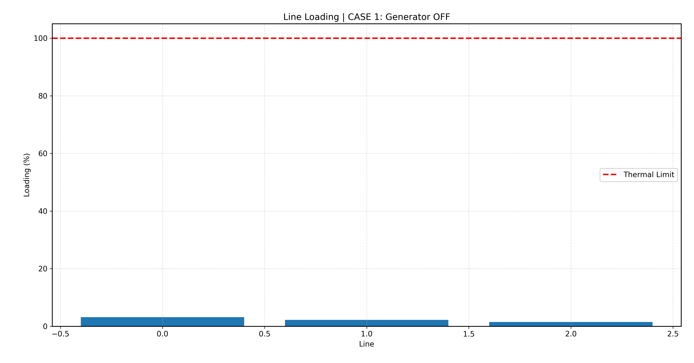
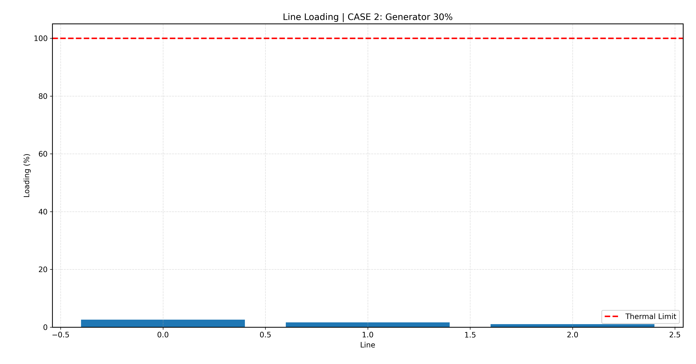
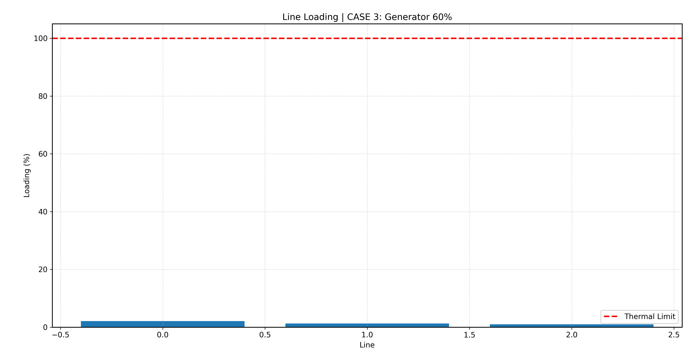
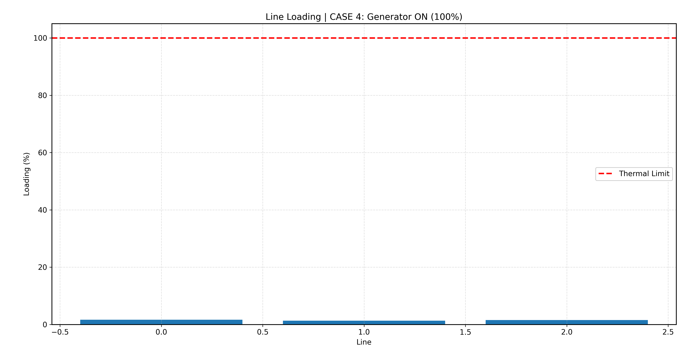
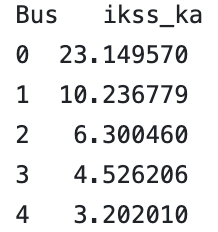
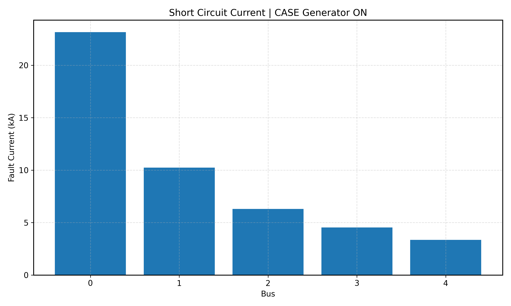
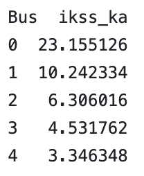

# MICRO-HYDROPOWER DESIGN PART II - GRID INTEGRATION & POWER SYSTEM MODELLING
> This projects build on [Part I - Site Assessment](https://github.com/aa-sharma/micro_hydro_bc) where we identified candidate locations for a micro-hydropower plant in rural Southwest British Columbia. In this project, we assume a capacity of 100kW for the candidate site and conduct a radial distribution feeder impact study through load flow, voltage rise analysis, and reverse power flow check under steady-state and fault conditions.
The grid integration loosely follows [BC Hydro's Distributed Generation Technical Interconnection Requirements - 100 kW and Below (DGTIR-100)](https://www.bchydro.com/content/dam/BCHydro/customer-portal/documents/distribution/standards/ds-dgi-100kw-and-below-requirements.pdf)

 

## System Definition
* 1 slack bus (utility substation)
* 1 feeder (radial)
* 3 loaded buses (representing residential/rural demand)
* 1 generator bus (100kW micro-hydro)
* 1 transformer (steps voltage up from 480V to 12.47kV)

 

               
### Design Simplifications and Assumptions
* Constant power loads (PQ)
* Typical line imepedance values
* Balanced 3-phase system
* Harmonics are ignored

### Generator & Transformer Attributes
The following attributes are assumed for the 100kW micro-hydro power plant:
* Power Rating: 100kW
* Voltage: 480V (3-phase)
* Frequency: 60Hz (synchronized with local BC Hydro grid standards)
* Generator Type: Asynchronous generator
* Step-up Transformer: 0.48kV -> 12.47kV, 150kVA

## Areas of Study
1. Power flow (Voltage profile)
2. Line Loading
3. Transformer Loading
4. Reverse power flow check
5. Short-circuit analysis

## Power Flow
"Power Flow Analysis is considered the backbone of modern power systems because it plays a vital role in ensuring the grid's reliable, efficient, and safe operation. By providing a detailed assessment of power Generation, Transmission and distribution, Load Flow Analysis helps engineers optimize system performance, maintain voltage stability, and reduce power losses. It also serves as a foundation for other advanced power system studies, such as harmonic analysis and stability assessments."

1. Voltage Profile: Ensuring that voltage levels across all buses remain within tolerable limits.
2. Real Power Loss Minimization: Identifying and reducing energy losses in transmission lines and transformers.
3. System Optimization: Optimizing the capital investment by optimally selecting the equipment ratings and their configurations

The Newton-Raphson method is used by the program in this study.

Case 1: Generator OFF (baseline voltage profile)

Case 2: Partial generation (30% i.e. 30kW)

Case 3: Partial generation (60% i.e. 60kW)

Case 4: Generator ON (100% i.e. 100kW)

## Simulation
Simulations performed in python using [pandapower](https://pandapower.readthedocs.io/en/latest/powerflow/ac.html)

### Outputs

#### Single Line Diagram

#### Voltage Profiles

Plotting the normalized voltage against the Bus number.

Baseline feeder drop demonstrates voltage dropping due to line impedance as current flows from grid to loads. Distributed generation (DG) injection improves voltage downstream (more flat). Rate limits of 0.97-1.03 pu respected.

#### Voltage Angles

Plotting the voltage angle against the Bus number. Angle difference drives real power flow (higher to lower).

A localized voltage angle deviation of 2.36° at the generator bus (at 100% generation) suggests a concentrated real power injection point with limited feeder impedance, resulting in a sharp phase shift localized at the point of generation. While not indicative of instability, this behavior suggests the model is highly idealized and may underrepresent feeder impedance effects

#### Line Loading

Plotting line loading (as a percentage of thermal rating) against line number
* 0: Between Slack and bus1
* 1: Between bus1 and bus2
* 2: Between bus2 and bus3
  

Highest loading occurs near substation because upstream lines carry all load. With injection of DG, upstream loading drops. All cases under 100% (i.e. no overloading).

#### Transfomer Loading

Plotting transformer loading (as a percentage of transformer capacity). Note, x-axis value is irrelavant (only one transformer present)

Transformer loading increases as DG increases. All cases are under 100% (i.e. no transformer overloading).

#### Short-Circuit Analysis

The inclusion of the 100 kW micro-hydro generator results in a small localized increase in short-circuit current at the point of interconnection, while having negligible impact on upstream fault levels due to the dominance of the utility grid impedance.

## Conclusion
This study demonstrated the successful modelling and analysis of a conceptual 100 kW micro-hydropower plant interconnected to a 12.47 kV radial distribution feeder using pandapower. Under all simulated operating conditions, the distributed generator improved downstream voltage support, reduced upstream feeder loading, and remained within acceptable transformer loading limits. Short-circuit analysis showed only a localized increase in fault current contribution near the point of interconnection, with negligible impact on upstream fault levels due to the dominant utility grid.

Overall, the results suggest that a 100 kW micro-hydropower generator can be feasibly integrated into a distribution feeder of this type, provided standard interconnection requirements, transformer sizing, and protection considerations are satisfied.
