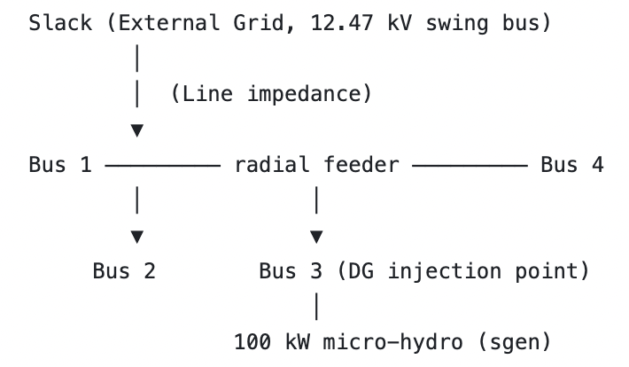
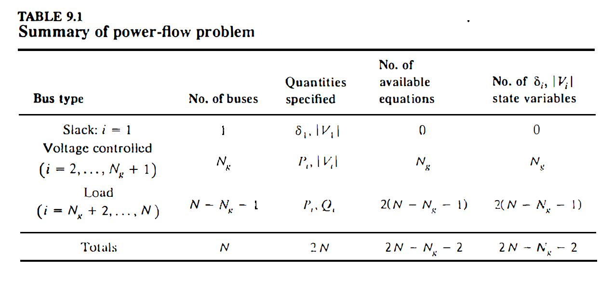
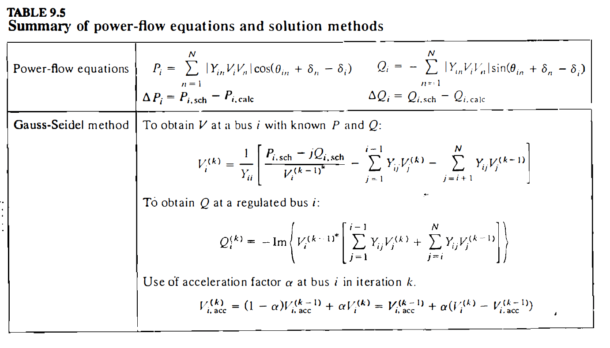
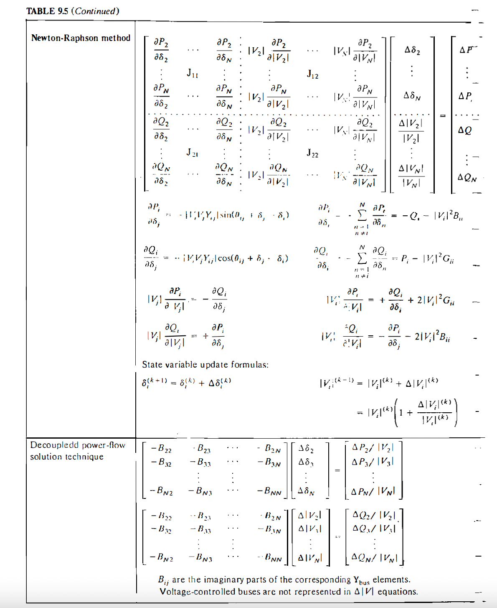
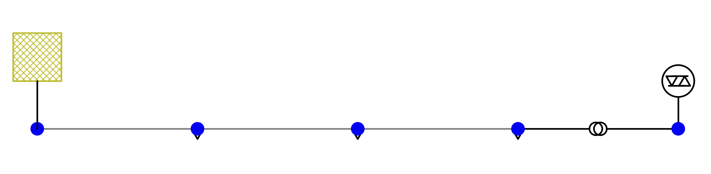

# MICRO-HYDROPOWER DESIGN PART II - GRID INTEGRATION & POWER SYSTEM MODELLING
> This projects build on [Part I - Site Assessment](https://github.com/aa-sharma/micro_hydro_bc) where we identified candidate locations for a micro-hydropower site in rural Southwest British Columbia. In this project, we assume a capacity of 100kW for the candidate site and conduct a radial distribution feeder impact study through load flow, voltage rise analysis, and reverse power flow check under steady-state and fault conditions.
The grid integration loosely follows [BC Hydro's Distributed Generation Technical Interconnection Requirements - 100 kW and Below (DGTIR-100)](https://www.bchydro.com/content/dam/BCHydro/customer-portal/documents/distribution/standards/ds-dgi-100kw-and-below-requirements.pdf)

## System Definition
* 1 slack bus (utility substation)
* 1 feeder (radial)
* 3 loaded buses (representing residential/rural demand)
* 1 generator bus (100kW micro-hydro)
* 1 transformer (steps voltage up from 480V to 12.47kV)

 

               
### Design Simplifications and Assumptions
* Constant power loads (PQ)
* Typical line imepedance values
* Balanced 3-phase system
* Harmonics are ignored

### Generator Attributes
The following attributes are assumed for the 100kW micro-hydro power plant:
* Power Rating: 100kW
* Voltage: 480V (3-phase)
* Frequency: 60Hz (synchronized with local BC Hydro grid standards)
* Generator Type: Asynchronous generator

## Areas of Study
1. Power flow (Voltage profile)
2. Reverse power flow
3. Transformer behaviour
4. Short-circuit analysis

## Power Flow
"Power Flow Analysis is considered the backbone of modern power systems because it plays a vital role in ensuring the grid's reliable, efficient, and safe operation. By providing a detailed assessment of power Generation, Transmission and distribution, Load Flow Analysis helps engineers optimize system performance, maintain voltage stability, and reduce power losses. It also serves as a foundation for other advanced power system studies, such as harmonic analysis and stability assessments."

1. Voltage Profile: Ensuring that voltage levels across all buses remain within tolerable limits.
2. Real Power Loss Minimization: Identifying and reducing energy losses in transmission lines and transformers.
3. System Optimization: Optimizing the capital investment by optimally selecting the equipment ratings and their configurations

Case 1: Generator OFF (baseline voltage profile)

Case 2: Generator ON (100kW generation)

Case 3: Partial generation (30%, 60%)

## Simulation
Simulations performed in python using [pandapower](https://pandapower.readthedocs.io/en/latest/powerflow/ac.html)

### Outputs

Single Line Diagram

